# Arm Platform

> A **ROS 2 control framework for real robotic arm hardware**

`arm_platform` is a **layered, decoupled, and extensible** robotic arm hardware control framework,
designed to connect **ROS 2 / MoveIt** with **real motors, communication protocols, and mechanical structures**.

This is not a demo, but a **production-ready** architecture design.

------

## 🎯 Design Goals

- Support **different robotic arm structures**
- Support **different motor types**
- Support **different communication protocols (Serial / CAN / UDP)**
- Control algorithms **independent of ROS**
- Hardware changes **do not affect upper-level logic**
- Easy integration with MoveIt / Servo / custom controllers

In one sentence:

> **Thoroughly decouple "Robotic Arm / Motor / Protocol / ROS"**

------

## 🧱 System Architecture

```mermaid
classDiagram

class MasterArmNode {
  +ControlLoop()
  +ComputeAndPublishCompensation()
  +DebugInfoCallback()
  -control_timer_
  -debug_timer_
  -pub_joint_state_
  -sub_uav_pose_
  -sub_slave_state_
  -arm_
  -gravity_compensation_
  -uav_joint_currents
  -uav_compensation_torques
}

class SlaveArmNode {
  +ControlLoop()
  -control_timer_
  -pub_joint_state_
  -arm_
}

class GravityCompensation {
  +SetParams()
  +SetUavPose()
  +Compute()
  +collision_detection()
  -DhTransform()
  -ForwardKinematics()
  -params_
  -uav_pose_
}

class IArm {
  <<interface>>
  +SetMotorCommand()
  +GetJointStates()
}

class AbsArm {
  <<abstract>>
  +SetBus()
  +SetMotorCommand()
  +SetJointStates()
  +GetJointStates()
  +AddMotor()
  +RemoveMotor()
  -bus_
  -motor_map_
}

class AL1Beta {
  +Instance()
  +Init()
  +GetState()
  -protocol_
}

class IBus {
  <<interface>>
  +Send()
  +Read()
}

class AbsBus {
  <<abstract>>
  +Send()
  +Read()
  -protocol_factory_
}

class SerialBus {
  +SerialBus()
  +SendCore()
  +ReadCore()
  -serial_
}

class IProtocol {
  <<interface>>
  +Pop()
  +Feed()
}

class AbsProtocol {
  <<abstract>>
  +Pop()
  +Feed()
}

class ProtocolFactory {
  +GetProtocol()
  +Add()
  +IterateEach()
  -protocols_
}

class ProtocolV1 {
  +Pop()
  +Feed()
  +GetPosition()
  +GetVelocity()
  +GetCurrent()
  +GetTemperature()
  +GetVoltage()
  +SetPosition()
  +SetVelocity()
  +SetCurrent()
  +SetKp()
  +SetKd()
  -Check()
  -DecodeFrame()
  -MakeFrame()
  -bytes_to_send_
  -recv_
  -positions_
  -velocities_
  -currents_
  -temperatures_
  -voltages_
}

class IMotor {
  <<interface>>
  +UpdateState()
  +SetState()
  +UpdateCommand()
}

class DMMotor {
  +UpdateState()
  +SetState()
  +UpdateCommand()
}

MasterArmNode --> GravityCompensation
MasterArmNode --> IArm
SlaveArmNode --> IArm
SlaveArmNode --> GravityCompensation
AL1Beta --|> AbsArm
AbsArm ..|> IArm
AbsArm *--> IBus
AbsArm o--> IMotor
AbsBus ..|> IBus
SerialBus --|> AbsBus
AbsBus *--> ProtocolFactory
ProtocolFactory --> IProtocol
AbsProtocol ..|> IProtocol
AbsProtocol o--> IMotor
ProtocolV1 --|> AbsProtocol
DMMotor --|> IMotor
```



------

## 📦 Directory Structure

```
arm_platform/
├── include/manipulator/
│   ├── arm/                 # Arm implementations
│   │   ├── abs_arm.h       # Abstract arm base class
│   │   ├── i_arm.h          # Arm interface
│   │   └── a_l1_beta.h     # AL1Beta arm implementation
│   ├── bus/                 # Communication buses
│   │   ├── abs_bus.h       # Abstract bus base class
│   │   ├── i_bus.h          # Bus interface
│   │   └── serial_bus.h     # Serial bus implementation
│   ├── protocol/             # Communication protocols
│   │   ├── abs_protocol.h   # Abstract protocol base class
│   │   ├── i_protocol.h      # Protocol interface
│   │   └── protocol_v1.h    # V1 protocol implementation
│   ├── controller/           # Controllers
│   │   ├── dummy_controller.h
│   │   └── i_arm_controller.h
│   ├── motor/               # Motor implementations
│   │   ├── abs_motor.h
│   │   ├── dm_motor.h
│   │   └── i_motor.h
│   ├── arm_hardware_node.h
│   ├── gravity_compensation.h
│   ├── master_arm_node.h
│   ├── slave_arm_node.h
│   └── arm_types.h
│
├── src/
│   ├── arm/
│   │   ├── abs_arm.cc
│   │   └── a_l1_beta.cc
│   ├── bus/
│   │   ├── abs_bus.cc
│   │   └── serial_bus.cc
│   ├── protocol/
│   │   ├── abs_protocol.cc
│   │   ├── dummy_link_protocol.cc
│   │   ├── protocol_factory.cc
│   │   └── protocol_v1.cc
│   ├── controller/
│   │   └── dummy_controller.cc
│   ├── motor/
│   │   ├── abs_motor.cc
│   │   └── dm_motor.cc
│   ├── arm_hardware_node.cc
│   ├── gravity_compensation.cc
│   ├── master_arm_node.cc
│   └── slave_arm_node.cc
│
├── launch/
│   ├── demo.launch.py
│   ├── master_arm.launch.py
│   └── slave_arm.launch.py
│
├── docker/
│   ├── Dockerfile.verify
│   └── README.md
│
├── CMakeLists.txt
├── package.xml
├── .gitlab-ci.yml
└── README.md
```

------

## 🧠 Core Modules

### 1️⃣ Gravity Compensation (`GravityCompensation`)

Computes **gravity compensation torques** for a 7-DOF robotic arm
based on forward kinematics and mass properties of each link.

**Responsibilities:**
- Forward kinematics computation
- Center of mass position calculation
- Gravity torque compensation
- Collision detection based on force feedback

**Key Parameters:**
- `G_GAIN_0/1/2`: Gains for different joint groups
- `MAX_TORQUE`: Maximum torque limit
- `GRAVITY`: Gravity acceleration (default: 9.81 m/s²)
- `FORCE_FEEDBACK_THRESHOLD`: Force threshold for collision detection
- `FORCE_FEEDBACK_GAIN`: Gain for force feedback control

**Usage:**
```cpp
GravityCompensation gc;
gc.SetParams(G_GAIN_0, G_GAIN_1, G_GAIN_2, MAX_TORQUE, GRAVITY, 
               FORCE_FEEDBACK_THRESHOLD, FORCE_FEEDBACK_GAIN);
gc.SetUavPose(uav_pose);
auto torques = gc.Compute(joint_positions);
```

------

### 2️⃣ Master Arm Node (`MasterArmNode`)

ROS 2 node for **ground station master arm control**.

**Responsibilities:**
- Subscribe to slave arm state and UAV pose
- Compute gravity compensation torques
- Apply collision detection if enabled
- Publish joint states
- High-frequency control loop (200Hz)

**ROS Interfaces:**
- **Subscribe:** `/uav_pose` (geometry_msgs/Point)
- **Subscribe:** `/slave/joint_state` (sensor_msgs/JointState)
- **Publish:** `/joint_states` (sensor_msgs/JointState)

**Key Parameters:**
- `port_name`: Serial port device path
- `G_GAIN_0/1/2`: Gravity compensation gains
- `MAX_TORQUE`: Maximum torque limit
- `GRAVITY`: Gravity acceleration
- `uav_roll/pitch/yaw`: UAV orientation
- `debug_info`: Enable debug output
- `debug_rate`: Debug output frequency
- `FORCE_FEEDBACK_THRESHOLD`: Collision detection threshold
- `FORCE_FEEDBACK_GAIN`: Force feedback gain
- `publish_joint_state`: Publish joint states

------

### 3️⃣ AL1Beta Arm (`AL1Beta`)

Implementation of **AL1Beta 7-DOF robotic arm** with serial communication.

**Responsibilities:**
- Hardware initialization and communication
- Joint state feedback (position, velocity, current, voltage, temperature)
- Motor command transmission
- Singleton pattern for hardware access

**Joint State Structure:**
```cpp
struct JointState {
    std::vector<double> position;      // radians
    std::vector<double> velocity;      // rad/s
    std::vector<double> current;       // Amperes
    std::vector<double> voltage;       // Volts
    std::vector<double> temperature;   // Celsius
};
```

**Usage:**
```cpp
auto& arm = arm::AL1Beta::Instance();
arm.Init("/dev/ttyUSB0", 921600);
arm::AL1Beta::JointState state;
arm.GetState(state);
```

------

### 4️⃣ Abstract Arm (`AbsArm`)

Base class for **all robotic arm implementations**.

**Responsibilities:**
- Motor management
- Bus communication
- Joint state handling
- Command transmission

**Key Methods:**
- `SetBus()`: Set communication bus
- `SetMotorCommand()`: Send motor commands
- `SetJointStates()`: Set joint states (for simulation)
- `GetJointStates()`: Get joint states from hardware
- `AddMotor()`: Add motor to arm
- `RemoveMotor()`: Remove motor from arm

------

### 5️⃣ Serial Bus (`SerialBus`)

Serial communication implementation for **motor communication**.

**Responsibilities:**
- Serial port management
- Data transmission and reception
- Protocol integration

**Usage:**
```cpp
auto bus = std::make_unique<bus::SerialBus>(
    "/dev/ttyUSB0", 921600, std::move(protocol_factory));
```

------

### 6️⃣ Protocol V1 (`ProtocolV1`)

V1 communication protocol for **AL1Beta arm**.

**Responsibilities:**
- Frame encoding/decoding
- Motor command generation
- Feedback data parsing
- PID parameter management

**Supported Commands:**
- Position control
- Velocity control
- Current control
- PID gains (Kp, Kd)

**Feedback Data:**
- Joint position
- Joint velocity
- Motor current
- Motor voltage
- Motor temperature

------

## 🔄 Control Flow

```
UAV Pose & Slave State
        ↓
MasterArmNode::ControlLoop (200Hz)
        ↓
GravityCompensation::Compute()
        ↓
Collision Detection (if enabled)
        ↓
AL1Beta::SetMotorCommand()
        ↓
SerialBus::Send() → Hardware
        ↓
SerialBus::Read() ← Hardware
        ↓
ProtocolV1::Decode()
        ↓
MasterArmNode::PublishJointState()
```

------

## 📡 ROS Interfaces

### Topics

#### Published Topics
- `/joint_states` (sensor_msgs/JointState)
  - Joint positions, velocities, currents, voltages, temperatures

#### Subscribed Topics
- `/uav_pose` (geometry_msgs/Point)
  - UAV orientation (roll=x, pitch=y, yaw=z in radians)
- `/slave/joint_state` (sensor_msgs/JointState)
  - Slave arm joint state for force feedback

------

## 🚀 Build and Run

### Build

#### Method 1: Using Docker (Recommended)

```bash
cd /path/to/arm-platform

# Quick verification using build script
./docker/build.sh verify

# Full build using build script
./docker/build.sh build

# Or manual build
docker build -f docker/Dockerfile.verify -t manipulator:verify .
docker run --rm manipulator:verify
```

**Build Script Options:**
- `verify`: Quick compilation verification (default)
- `build`: Full build with all dependencies

#### Method 2: Native Build

```bash
cd /path/to/workspace
colcon build --packages-select manipulator
source install/setup.bash
```

### Run Master Arm

```bash
ros2 launch manipulator master_arm.launch.py
```

**Launch Parameters:**
- `port_name`: Serial port device path (default: `/dev/ttyUSB1`)
- `G_GAIN_0`: Gain for base joints 0-1 (default: `0.0`)
- `G_GAIN_1`: Gain for arm joints 2-3 (default: `0.5`)
- `G_GAIN_2`: Gain for wrist joints 4-6 (default: `1.0`)
- `MAX_TORQUE`: Maximum torque limit (default: `3.0`)
- `GRAVITY`: Gravity acceleration in m/s² (default: `9.81`)
- `uav_roll`: UAV roll angle in radians (default: `0.0`)
- `uav_pitch`: UAV pitch angle in radians (default: `0.0`)
- `uav_yaw`: UAV yaw angle in radians (default: `0.0`)
- `debug_info`: Enable debug output (default: `True`)
- `debug_rate`: Debug output frequency in Hz (default: `1.0`)
- `FORCE_FEEDBACK_THRESHOLD`: Force threshold for collision detection (default: `0.5`)
- `FORCE_FEEDBACK_GAIN`: Force feedback gain (default: `0.5`)
- `publish_joint_state`: Publish joint states (default: `False`)

**Example with custom parameters:**
```bash
ros2 launch manipulator master_arm.launch.py port_name:=/dev/ttyUSB2 G_GAIN_0:=0.5 debug_info:=False
```

### Run Slave Arm

```bash
ros2 launch manipulator slave_arm.launch.py
```

**Launch Parameters:**
- `port_name`: Serial port device path (default: `/dev/ttyUSB0`)
- `G_GAIN_0`: Gain for base joints 0-1 (default: `0.5`)
- `G_GAIN_1`: Gain for arm joints 2-3 (default: `0.5`)
- `G_GAIN_2`: Gain for wrist joints 4-6 (default: `1.0`)
- `MAX_TORQUE`: Maximum torque limit (default: `3.0`)
- `GRAVITY`: Gravity acceleration in m/s² (default: `9.81`)
- `FORCE_FEEDBACK_THRESHOLD`: Force threshold for collision detection (default: `0.5`)
- `FORCE_FEEDBACK_GAIN`: Force feedback gain (default: `0.5`)
- `debug_info`: Enable debug output (default: `True`)
- `debug_rate`: Debug output frequency in Hz (default: `1.0`)
- `publish_joint_states`: Publish joint states (default: `True`)

**Example with custom parameters:**
```bash
ros2 launch manipulator slave_arm.launch.py port_name:=/dev/ttyUSB1 G_GAIN_0:=1.0 debug_info:=False
```

### Run Demo

```bash
ros2 launch manipulator demo.launch.py
```

------

## 🧩 Extension Guide

### ➕ Add New Motor / Protocol

1. Implement `IMotor` interface
2. Implement `ILinkProtocol` interface
3. Implement `IBus` interface
4. Inject into `AbsArm`

**No need to modify controller and ROS node**

### ➕ Add New Arm

1. Implement `IArm` interface
2. Extend `AbsArm` base class
3. Implement specific protocol and bus
4. Add to ROS node

### ➕ Add New Control Algorithm

1. Create new controller class
2. Implement control logic
3. Integrate with ROS node

------

## 🛣️ Future Plans

- [ ] Integration with ros2_control
- [ ] MoveIt Servo native support
- [ ] Real-time control executor
- [ ] Multi-arm support
- [ ] Safety and limit layer
- [ ] Collision avoidance
- [ ] Trajectory tracking

------

## 📝 Dependencies

- **ROS 2 Humble**
- **Eigen3**: Linear algebra library
- **Serial**: Serial communication library
- **Boost**: C++ utility libraries
- **dummy_interface**: Custom motor interface messages

------

## 📄 License

MIT License

------

## 👥 Authors

Benjamin Chen

------

## 📧 Development

### Docker Build Verification

```bash
cd docker
docker build -f Dockerfile.verify -t manipulator:verify .
docker run --rm manipulator:verify
```

### GitLab CI

Automatic CI pipeline runs on `develop` branch:
- Builds Docker image
- Runs compilation verification
- Saves build logs as artifacts

See [.gitlab-ci.yml](.gitlab-ci.yml) for configuration.

------

## 📞 Support

For issues and questions, please open an issue on the project repository.
